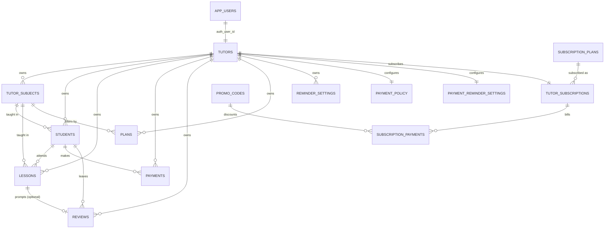

# Data map

Canonical reference for every data type in this project: what it is, what
fields it carries, how entities relate, and where each one is produced and
consumed (DB table → API route → shared type → UI screen). Keep this in sync
whenever `db/schema.sql` or `packages/shared/src/*.ts` changes — those two
are the actual source of truth; this document is the human-readable index
over them.

## 1. Entity-relationship overview

Two independent graphs share only the `tutors` node:

- **Tutoring business** (left/center): tutor → subjects → students → lessons/payments/reviews → plans. This is *the tutor's own data* about running their tutoring practice.
- **App billing** (right): subscription_plans → tutor_subscriptions → subscription_payments. This is *the tutor as your customer*, paying for the app itself. Never join across these two except to gate feature access (e.g. "is this tutor's subscription active enough to add a 16th student").

## 2. Entities

Each table below: DB table (snake_case, `db/schema.sql`) → TS type
(camelCase, `packages/shared/src/entities.ts`) → who writes it → who reads it.

### app_users
Login identity. Not exposed to the frontend as an entity — only indirectly via `Tutor.authUserId`.
| Column | Type | Notes |
|---|---|---|
| id | uuid PK | |
| email | text, unique | |
| password_hash | text | bcrypt, never sent to the client |
| created_at | timestamptz | |

Written by: `POST /auth/register`. Read by: `POST /auth/login` (credential check only).

### tutors → `Tutor`
The account owner / business profile.
| Column | Type | Notes |
|---|---|---|
| id | uuid PK | |
| auth_user_id | uuid, FK → app_users | |
| name, age, age_visible | | age hidden from public card if `age_visible=false` |
| total_experience_years, education, awards, greeting_text | | shown on public card |
| photo_url | | |
| public_slug | text, unique | public card URL: `/t/:slug` |
| contact_telegram, contact_whatsapp, contact_max, contact_email, contact_phone | | all nullable, only filled ones shown publicly |
| theme_preference | enum light\|dark\|system | |
| created_at, updated_at | | |

Written by: `PATCH /tutors/me`, registration. Read by: `GET /tutors/me` (Settings), `GET /public/tutors/:slug` (Public Tutor Card — a restricted projection, see §4).

### tutor_subjects → `TutorSubject`
| Column | Type | Notes |
|---|---|---|
| id | uuid PK | |
| tutor_id | FK | |
| subject_name | text | e.g. "Алгебра" |
| experience_years | int | |
| default_price | numeric(10,2) | per-lesson price, overridable per student |
| is_active | boolean | false = not taking new students, history kept |

Written by: `POST /tutors/me/subjects`, `PATCH /tutors/me/subjects/:id`. Read by: Public Tutor Card ("Предметы и цены"), Create/Edit Lesson (subject dropdown), Students list (subject filter).

### students → `Student`
| Column | Type | Notes |
|---|---|---|
| id | uuid PK | |
| tutor_id | FK | |
| name, age | | |
| contact_telegram, contact_phone | | |
| subject_id | FK → tutor_subjects, nullable | one subject per student, see data-map §5.3 |
| custom_price | numeric, nullable | overrides `tutor_subjects.default_price` |
| status | enum active\|paused\|archived | |
| graduated | boolean | manually set on archive; drives public "graduated" count |

Written by: `POST /students`, `PATCH /students/:id`. Read by: Students list, Student Profile, Today (via lessons join), Create/Edit Lesson (student dropdown).

### lessons → `Lesson`
| Column | Type | Notes |
|---|---|---|
| id | uuid PK | |
| tutor_id, student_id | FK | |
| scheduled_at | timestamptz | |
| planned_duration_min | int, default 60 | |
| status | enum planned\|completed\|cancelled\|rescheduled\|on_hold | |
| price_charged | numeric, nullable | snapshot at creation/completion — history stays correct if prices change later |
| actual_duration_min, subject_id, topic, grade (1-10), comment | | post-lesson fields, filled by the "Занятие проведено" toggle |

Written by: `POST /lessons` (plan), `POST /lessons/:id/complete` (fills post-lesson fields), `POST /lessons/:id/cancel`. Read by: Today, Student Profile (history), Plan (progress aggregation).

### payments → `Payment`
| Column | Type | Notes |
|---|---|---|
| id, tutor_id, student_id | | |
| amount | numeric(10,2) | |
| paid_at | timestamptz | |
| method | enum manual\|sbp\|yumoney\|other | |
| comment | text | |

Written by: `POST /payments`. Read by: Student Profile (payment history), `student_balance`/`student_debt_status` views.

### reviews → `Review`
| Column | Type | Notes |
|---|---|---|
| id, tutor_id, student_id | | |
| lesson_id | FK, nullable | which lesson prompted the review |
| rating | int 1-10 | |
| review_text, reviewer_display_name, reviewer_age, subject_name | | reviewer fields are free text, decoupled from `students.name` |
| is_hidden | boolean | tutor moderation, can't edit text |
| review_token | uuid, unique, nullable | one-time link |
| token_used | boolean | |

Written by: `POST /reviews/submit` (public, via token), `PATCH /reviews/:id/hidden` (tutor). Read by: Public Tutor Card, `tutor_rating` view.

### plans → `Plan`
Goal-tracking period; **progress is never stored**, always computed (`GET /plans/:id/progress`, see `PlanProgress` in §3).
| Column | Type | Notes |
|---|---|---|
| id, tutor_id | | |
| period_type | enum week\|month\|year | |
| period_start, period_end | date | |
| target_students, target_revenue, target_lessons, target_rating | | all nullable — set only the ones you're tracking |
| subject_filter_id | FK, nullable | narrow progress to one subject |

### reminder_settings → `ReminderSetting`
One row = one reminder at one offset. `target` distinguishes "remind the student" vs. "remind me."
| Column | Type |
|---|---|
| id, tutor_id | |
| target | enum student\|tutor |
| offset_minutes | int — UI's day/hour/minute stepper collapses into this, see data-map §5.1 |
| is_enabled | boolean |

### payment_policy → `PaymentPolicy` (one row per tutor)
`max_unpaid_lessons`, `block_enabled` — drives `student_debt_status.is_blocked`.

### payment_reminder_settings → `PaymentReminderSettings` (one row per tutor)
`is_enabled`, `start_after_days`, `repeat_every_days`, `max_reminders`.

### subscription_plans → `SubscriptionPlan`
Static-ish catalog (seeded, rarely changes): `key`, `name`, `price`, `billing_period`, `features` (jsonb string array), `is_popular`, `sort_order`.

### tutor_subscriptions → `TutorSubscription`
One row per tutor (unique `tutor_id`): `plan_id`, `status`, `current_period_start/end`, `cancel_at_period_end`, `discount_percent`/`discount_until` (retention offer).

### subscription_payments → `SubscriptionPayment`
Billing history/receipts: `tutor_subscription_id`, `amount`, `method` (card\|sbp), `status` (succeeded\|failed), `promo_code`, `paid_at`.

### promo_codes → `PromoCode`
`code`, `discount_percent`, `is_active`, `expires_at`.

## 3. Computed values (never stored — `db/views.sql` + `packages/shared/src/computed.ts`)

| View / type | Formula | Consumers |
|---|---|---|
| `student_balance` → `StudentBalance` | `sum(payments.amount) − sum(completed lessons.price_charged)` per student | Student Profile balance card |
| `student_debt_status` → `StudentDebtStatus` | balance converted to a lesson count via effective price, compared to `payment_policy.max_unpaid_lessons` | Today (blocked flag), Students list (debt filter), Create Lesson (on_hold decision) |
| `tutor_rating` → `TutorRating` | `avg(reviews.rating) where is_hidden=false` | Public Tutor Card |
| `tutor_graduated_count` → `TutorGraduatedCount` | `count(students where status='archived' and graduated=true)` | Public Tutor Card (future) |
| `lesson_day_summary` → `LessonDaySummary` | lessons + unpaid count grouped by day | Today header ("N занятий · M не оплачено") |
| — → `PlanProgress` | assembled per-request in `plans.routes.ts`, not a SQL view (needs the plan's own date range + subject filter) | Plan/Statistics screen |

## 4. Public vs. private data surfaces

`GET /public/tutors/:slug` (no auth) is a **restricted projection** of `tutors` —
it must never leak: `auth_user_id`, `contact_*` fields the tutor left empty
(only non-null contacts are returned), or `age` when `age_visible=false`. It
also never returns `reviews` where `is_hidden=true`, or any `tutor_subjects`
where `is_active=false`. If you add a field to `tutors` or `tutor_subjects`,
default it to **not** appearing in `public.routes.ts` until you've confirmed
it's meant to be public — the private/public boundary is enforced by the
route's explicit column list, not by a blanket `select *`.

## 5. Known modeling decisions / constraints worth remembering

1. **One subject per student.** `students.subject_id` is a single FK, not a
   join table. Confirmed against the design (see
   `docs/db-schema-analysis.md` §3.3) — a student who takes two subjects
   needs two `students` rows today. Revisit only if that becomes a real
   requirement (would need a `student_subjects` join table).
2. **Reminder offsets are a single integer.** `offset_minutes` is
   `days*1440 + hours*60 + minutes`; the day/hour/minute stepper in Settings
   is purely a UI affordance over that one column (`docs/db-schema-analysis.md` §3.1).
3. **`lessons.status = 'on_hold'` is not currently written anywhere** — the
   "blocked" indicator on lessons is computed live from
   `student_debt_status` at read time. The enum value is reserved for a
   future explicit "tutor deferred this lesson" action (`docs/db-schema-analysis.md` §3.2).
4. **Payment method granularity.** `payments.method='manual'` covers both
   cash and bank transfer; the UI's "Наличные"/"Перевод" distinction isn't a
   separate enum value yet (`docs/db-schema-analysis.md` §3.4).
5. **Auth is decoupled from Supabase Auth on purpose** — `app_users` is a
   local credentials table, not `auth.users`. See
   `docs/db-schema-analysis.md` §4 before changing anything auth-related.
6. **Demo/GitHub Pages build uses a separate, static dataset**
   (`apps/web/src/demo/dataset.json`, ~500 records) instead of live Postgres
   data — see `docs/demo-mode.md`. That dataset is illustrative only; do not
   treat it as a schema reference, `db/schema.sql` is still the only source
   of truth for shape.

## 6. Where to look for what

| I need to know... | Look at |
|---|---|
| Exact column types/constraints | `db/schema.sql` |
| Computed/derived field formulas | `db/views.sql` |
| TypeScript shape used by API + web | `packages/shared/src/entities.ts`, `computed.ts` |
| Request-body validation rules | `packages/shared/src/inputs.ts` |
| Which endpoint backs which screen | `README.md` §"Screen ↔ route ↔ table map" |
| Why a field exists / design rationale | `docs/db-schema-analysis.md` |
| Demo dataset shape/generation | `docs/demo-mode.md`, `scripts/generate-demo-data.mjs` |
